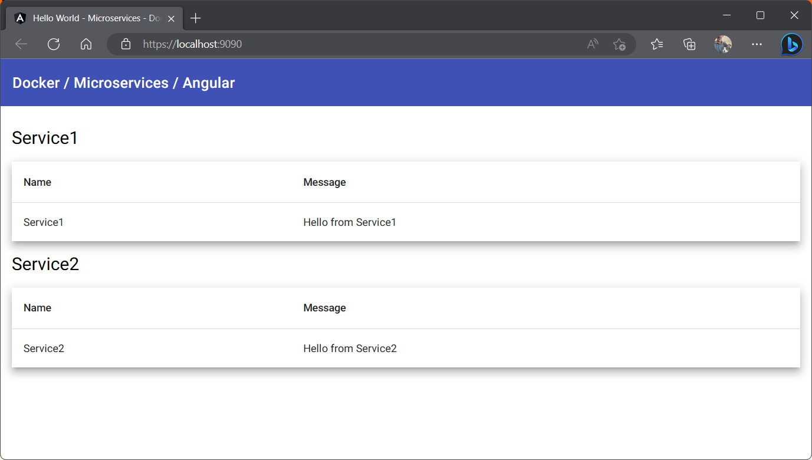

# docker-dotnet-angular

Dockerized .NET backend and Angular frontend.

Two containers:

- Frontend (Angular)
- Backend (Gateway, Service1 and Service2)

The following assumptions are made:

- You have Docker Desktop installed
- You have Visual Studio 2022 installed

## Create the following self signed certificates for each of the services located in the backend folder

`dotnet dev-certs https -ep $env:USERPROFILE\.aspnet\https\Gateway.pfx -p pa55w0rd!`

`dotnet dev-certs https -ep $env:USERPROFILE\.aspnet\https\Service1.pfx -p pa55w0rd!`

`dotnet dev-certs https -ep $env:USERPROFILE\.aspnet\https\Service2.pfx -p pa55w0rd!`

## Trust the certificates

`dotnet dev-certs https --trust`

## Switch to each of the services in the backend folder and run the following

`dotnet user-secrets set "Kestrel:Certificates:Development:Password" "pa55w0rd!"`

## Create the self signed certificate for the frontend located in the frontend folder

`dotnet dev-certs https -ep frontend.pfx -p pa55w0rd!`

`openssl pkcs12 -in ./frontend.pfx -clcerts -nokeys -out frontend.crt`

`openssl pkcs12 -in ./frontend.pfx -nocerts -nodes -out frontend.key`

Import frontend.pfx into your certificate store (Windows):

- Double-click on the self-signed certificate file (with the .crt extension) to open the certificate details.
- Click on the "Install Certificate" button.
- Select "Local Machine" and click "Next."
- Choose "Place all certificates in the following store" and click "Browse."
- Select "Trusted Root Certification Authorities" and click "OK."
- Click "Next" and then "Finish" to complete the installation.

## Build and run (do this in the frontend and backend folders)

docker-compose up --build

## Kubernetes

The deployment files have been created with stub values. I don't know enough about Kubernetes to make it work yet. Stay tuned!

## Screenshots

Docker Desktop

Frontend

## TODO

- localhost is hardcoded in Angular service which calls the backend
- The frontend is not served using HTTPS
- The Gateway, Service1 and Service2 should be in their own containers

## Helpful Resources

- <https://www.youtube.com/watch?v=UsoH5cqE1OA>

## Author

Frank Hale &lt;<frankhaledevelops@gmail.com>&gt;

## Date

23 May 2023
